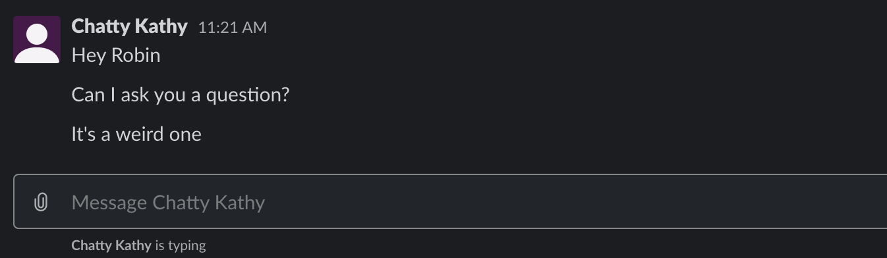

## Goals: Maximize Relevancy, Minimize Disruption

_We want everyone in our organization have the information they need to do their job most effectively._

Each person using Slack relies on everyone else in the organization so that they can get the most out of Slack. When only a few people have poor Slack etiquette, other people turn on Do Not Disturb, mute channels, and turn off mobile notifications altogether. Then those other people miss information, sometimes important and timely information.

### Create channels

- When starting a new project.
- When exploring a new business idea.
- When creating a new team.

### Channels need a topic

Without a topic, each person has a hard time deciding whether they should subscribe to notifications for the channel, or mute it altogether.

If too many topics are mixing in one channel, important things can be missed while unimportant things cause notification fatigue.

Even if the channel is a “team channel”, there are probably specific topics that can be moved to other channels. Think about how your teams will evolve and whether everyone working on those topics are going to be on the same team in the future.

### Make Channels public by default

Slack is an information repository for your organization. Information that is compartmentalized can’t be found by people who aren’t in the right channels, and they won’t even know that they’re missing access to it.

Private channels can never be made public. Ever. You can always make a public channel private though, so err on the side of openness.

### Don’t use direct messages for business

In the same way that private channels compartmentalize information, direct messages are both private and unshareable. You can’t add people to the discussion. You can’t share the contents of a direct message discussion. Ever.

In addition, direct messages send notifications to the recipient as if you were `@`-mentioning them. Notifications will be sent to their phone for every message you send. Sending such messages after hours or over the weekend is the equivalent of calling their mobile phone. If you want to post it while it’s on your mind, put it in a channel. They’ll see it the next time they open Slack.

### Don’t chat in #general

Rename it to `#announcements`. Don’t limit which people are allowed to post in it, but set a topic that makes it clear that it better be important and company-wide. (Hire smart people that know what this means.)

But letting everyone in the organization communicate in #announcements means that they can discuss, in a thread, things that are posted there. This should lead to more discourse and a feeling of openness.

### Use #random

If people are together in an actual (physical) room, they would say funny things to everyone in the room. Give them an outlet for things like that: use #random for funny things. Build camaraderie and culture.

### Channel for each office/region

Don’t let posts about the coffee maker or lunch or parking reimbursement be posted in company-wide channels. Make a channel just for office stuff.

Have more than one office? Make a channel for each office. Keep them public. People travel. Let them join and leave when they want.

(Imagine a Venn diagram of the different geographic groupings of people in your organization.)

### Use threads to reply

Make sure everyone turns on notifications for threads. Replying inside a thread means that people who have notifications turned on for the channel aren’t being notified for every message.

### Don't use `@` unless you need an immediate reply

You don't need to immediately draw someone’s attention to your message unless you need them to reply to it urgently. Use their name, not their `@`-handle.

Never use `@channel` or `@here` (or especially `@everyone`) unless your message is urgent.

### Don’t rely solely on Slack as a repository

Slack is better than having no record of discussions. But if you rely solely on Slack for this, it won’t be clear what the final decisions were, or whether that decision changed later. So use something like Notion, ADRs, or Google Docs. You can link directly to your Slack discussions when needed.

### Update your status—don’t post your status

People might be interested in whether you’re in the office, but they don’t need to have a message in the chat history about it. Just change your status.

### Get To It

Just ask your question or make your statement. Don’t do this:

(width: 800)

The above caused 3 notifications to be sent, and there’s nothing actionable yet!

### Mind a channel’s topic and not its members’ teams or interests

Don’t pick a channel based on who you want to share information with. Look for the channel with the most appropriate topic. People move around, but topics are forever.

### Before asking a question, search Slack

This is the goal of using Slack. When new people join, they can find answers to their questions. Otherwise, the organization is constantly answering the same questions. But not everyone at the organization, just the ones that know things. You know, the ones with the least time to answer questions.

### When answering a question, provide enough context for future searches.

Don’t just post a snippet of code. Describe it with words that will be used to search for it later.

### Name your uploaded files

So they can be found by searching later.

### Use reactions instead of replying with a message

Not always, but replies might send notifications when there’s no need for the extra chatter. A reaction to a message lets them see that you reacted if they go back to the channel (or immediately if they’re paying attention).

### Use the Up Arrow to edit

Don’t post messages correcting your mistakes, correct them. More messages mean more notifications.

(width: 400)

### Don’t write emails

Unless you’re posting announcements. 30 minutes spent crafting a 3-paragraph reply to someone’s message is 30 minutes before your interlocutor understands even slightly more than they did before. Think out loud. Make your conversation iterative rather than waterfall. In a thread so that people in the channel can avoid it if they prefer.

## More Reading

- [Slack Etiquette, Part 1: Organize & Be Mindful | Art & Science](https://artscience.ca/slack-etiquette-part-1-organize-be-mindful/)
- [Slack Etiquette: Part 2 - Respect your team, and be Mindful | Art & Science](https://artscience.ca/slack-etiquette-part-2-respect-your-team-and-be-mindful/)
- [The definitive guide to Slack etiquette | Hiver Blog](https://hiverhq.com/blog/slack-etiquette/)
